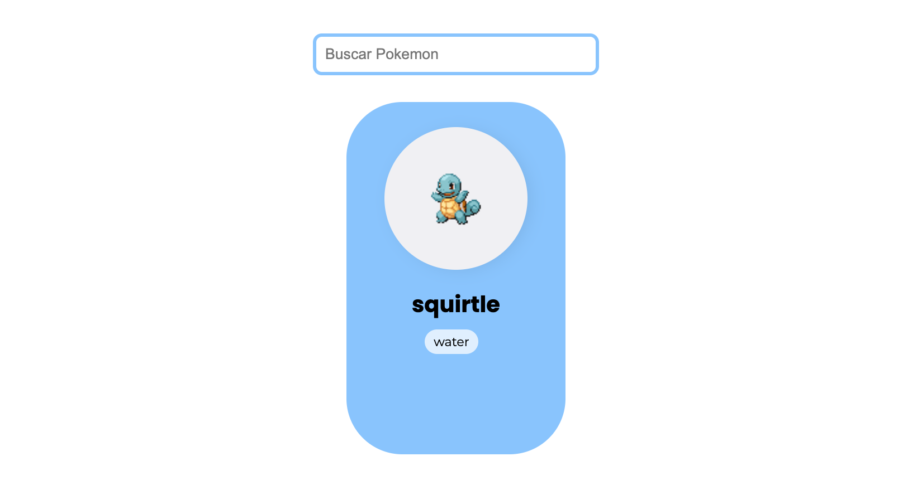

<h1 align="center"> Angular Services </h1>

Projeto do curso Desenvolvimento Frontend com Angular da DIO com foco em Services

  <a href="#tecnologias">Tecnologias</a>&nbsp;&nbsp;&nbsp;|&nbsp;&nbsp;&nbsp;
  <a href="#layout">Layout</a>&nbsp;&nbsp;&nbsp;|&nbsp;&nbsp;&nbsp;
  <a href="demo-page">Online Page</a>

 

  

## Tecnologias

Esse projeto foi desenvolvido com a seguintes tecnologias:

- [Angular CLI](https://github.com/angular/angular-cli) version 16.2.11.
- HTML
- CSS
- TypeScript

## Development server

Run `ng serve` for a dev server. Navigate to `http://localhost:4200/`. The application will automatically reload if you change any of the source files.

## Online Page
[Angular Blog](https://eneasmarques.github.io/angular-services/)
